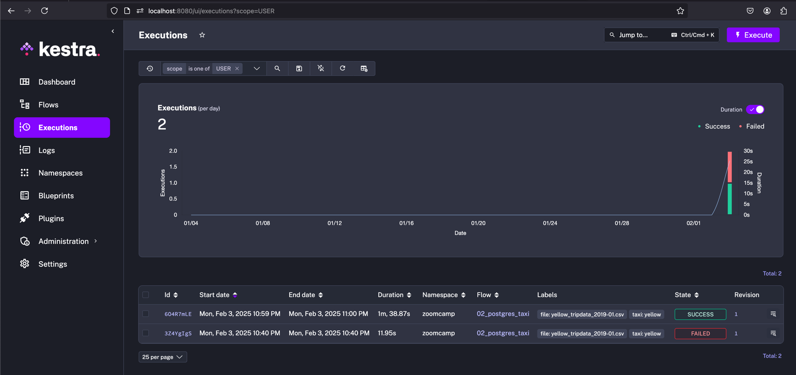

1. Starting with installing Kestra with a PostgreSQL database backend using a Docker Compose file.
https://kestra.io/docs/installation/docker-compose

    ```bash
    curl -o docker-compose.yml \
    https://raw.githubusercontent.com/kestra-io/kestra/develop/docker-compose.yml
    ```
2. Launch kestra (Use postgres 15 and up, also make sure you have logged in to docker desktop through cli)
    ```bash 
   docker-compose up -d
   ``` 
     

3. Open the URL http://localhost:8080 in browser to launch the UI.

   
4. Load sample ny taxi data in postgres table on docker container using Kestra:
   * Create a kestra flow by using code from <add link here to 02_postgres_taxi>
   * Click on Execute
   
   * 
   * 
   * Backfill running (Choose Trigger > Backfill and set some old date range)
   
5. Running kestra pipelines on bigquery