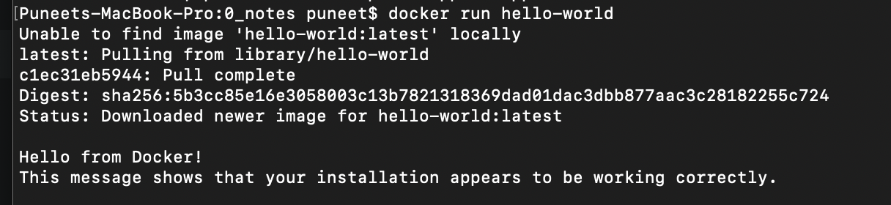
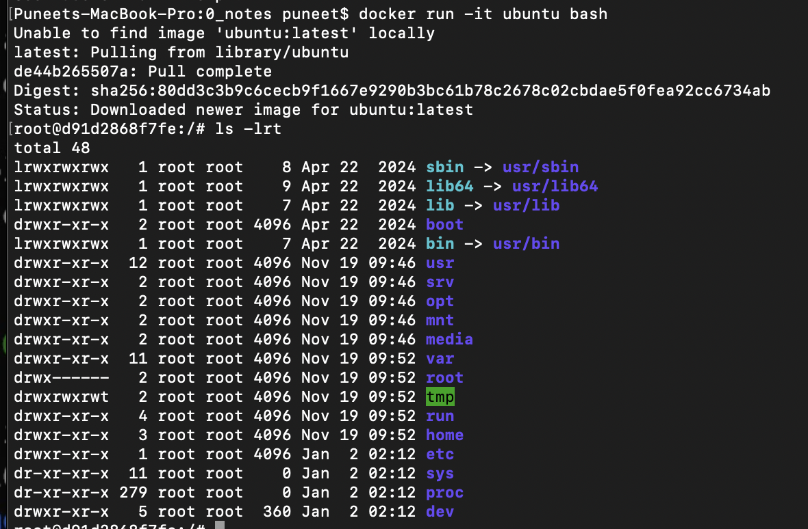
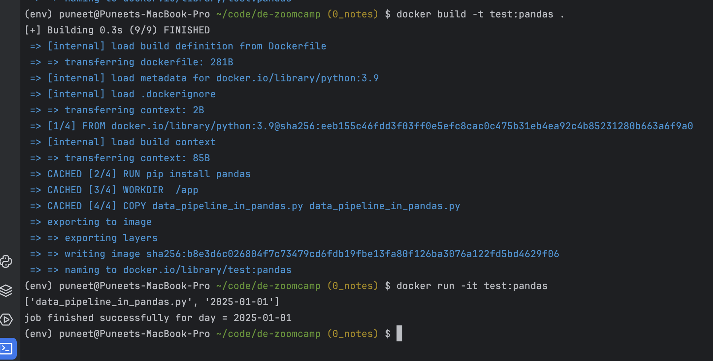
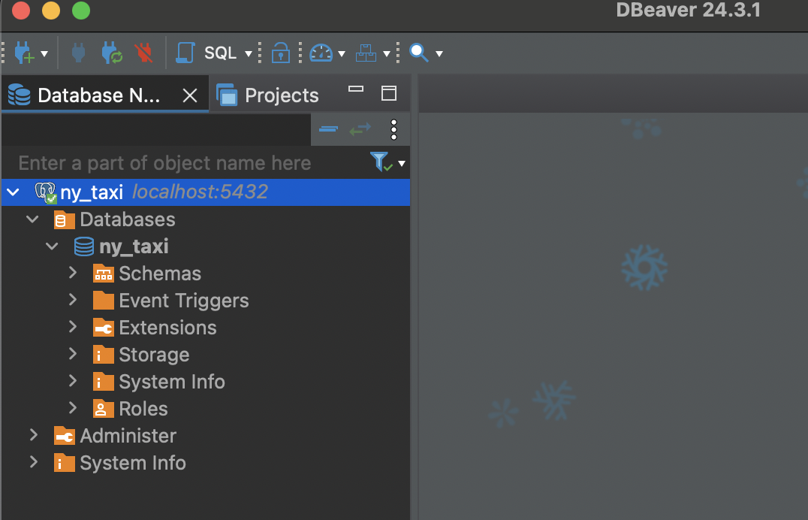

### Description  
This page contains main architecture diagram of data-engineering tools, techniques and pipelines and initial commands for 
installation packages

### Table of contents
1. [Install docker](#Install_docker)
2. [Create docker file](#create_docker_file)
3. [Build docker image](#build_docker_image)
4. [Run the docker image](#run_docker_image)

### Architecture diagram


### Action Items
1. Install docker <a name="Install_docker"></a>   
https://docs.docker.com/desktop/setup/install/mac-install/  
Test docker installation using following command 
    ```terminal
    docker run hello-world
    ```
      
    


2. Create docker file  <a name="create_docker_file"></a>  
Create Dockerfile in root dir with python 3.9 as base image and install pandas. Set entry 
point to run python script  

    ```dockerfile
   FROM python:3.9
   RUN pip install pandas
   WORKDIR  /app
   COPY data_pipeline_in_pandas.py data_pipeline_in_pandas.py
   ENTRYPOINT [ "python", "data_pipeline_in_pandas.py" ]
   # Default parameters
   CMD ["2025-01-01"]
   ```

3. Build docker image <a name="build_docker_image"></a>
    ```terminal
    docker build -t test:pandas .
    ```
   
4. Run the docker image <a name="run_docker_image"></a>
    ```terminal
    docker run -it test:pandas
    ```
   

5. Create postgres container through command line
   ```terminal
   docker run -it  \
   -e POSTGRES_USER="<user>" \
   -e POSTGRES_PASSWORD="<password>" \
   -e POSTGRES_DB="ny_taxi" \
   -p 5432:5432 \
   -v $(pwd)/2_docker_sql/postgres_sql_data:/var/lib/postgresql/data postgres:13 
   ```
6. Test postgres connection (using dbeaver)
 

7. Download New York Yellow taxi Dataset parquet file from this [link](https://www.nyc.gov/site/tlc/about/tlc-trip-record-data.page)
and load to postgres table as shown in file [upload_data_parquet.ipynb](https://github.com/punsharma07/de-zoomcamp/blob/a3e4aaa46118da914f9f960711d8ecfdb3a38dc7/2_docker_sql/upload_data_parquet.ipynb) 
or better readable python file [ingest_nytaxi_data.py](https://github.com/punsharma07/de-zoomcamp/blob/a3e4aaa46118da914f9f960711d8ecfdb3a38dc7/2_docker_sql/ingest_nytaxi_data.py)