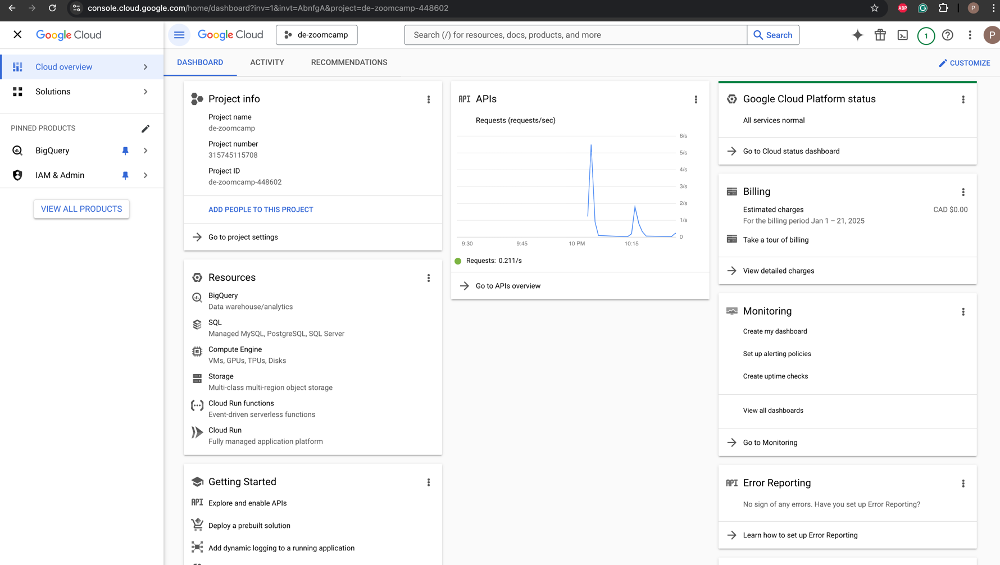
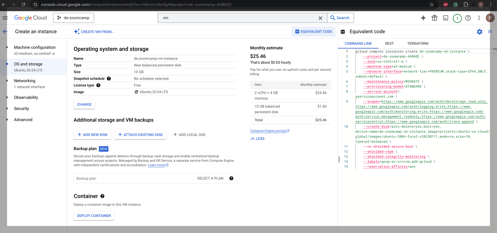
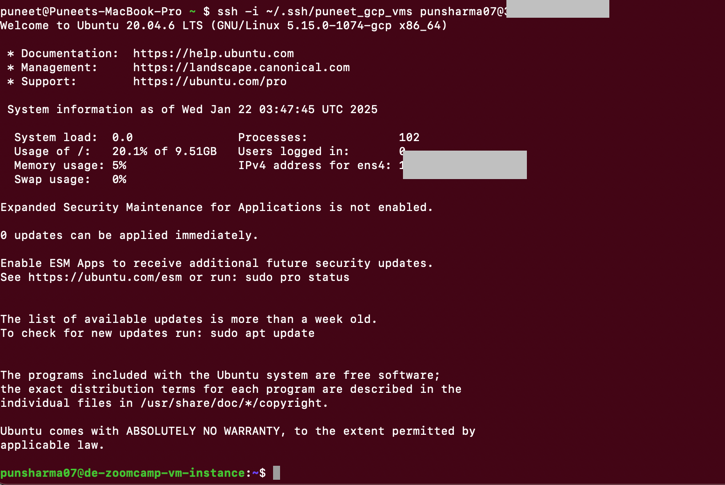
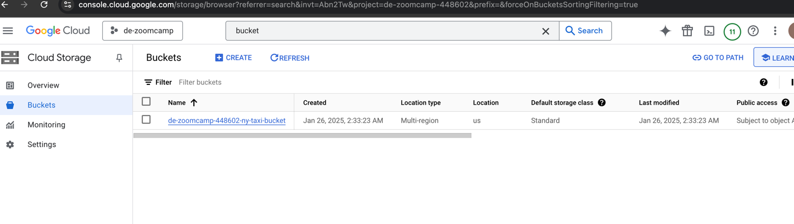

### GCP new VM instance setup and running ingest_nytaxi_data.py script in VM to load data in postgres
2. Create Google Cloud platform account and new project `de-zoomcamp`

2. Generate new ssh key on local terminal and copy public key in GCP's metadata by following Google's 
documentation https://cloud.google.com/compute/docs/connect/add-ssh-keys
3. Create a new VM instance by providing required details


4. Test ssh connection to gcp vm instances from local machine

5. Install Docker on new VM 
   1. Update packages  
             ```bash
             sudo apt-get update
             ```
   2. Set up Docker's apt repository.
   ```bash
   sudo apt-get install ca-certificates curl
   sudo install -m 0755 -d /etc/apt/keyrings
   sudo curl -fsSL https://download.docker.com/linux/ubuntu/gpg -o /etc/apt/keyrings/docker.asc
   sudo chmod a+r /etc/apt/keyrings/docker.asc
      
   # Add the repository to Apt sources:
   "deb [arch=$(dpkg --print-architecture) signed-by=/etc/apt/keyrings/docker.asc] https://download.docker.com/linux/ubuntu \
   $(. /etc/os-release && echo "$VERSION_CODENAME") stable" | \
   sudo tee /etc/apt/sources.list.d/docker.list > /dev/null
   ```
   3. Install docker latest version
   ```bash
   sudo apt-get install docker-ce docker-ce-cli containerd.io docker-buildx-plugin docker-compose-plugin
   ```
   4. Test docker installation
   ```bash
   sudo docker run hello-world
   ```
   5. To create the docker group and add your user:
   ```bash
   #Create the docker group.
   sudo groupadd docker
      
   #Add your user to the docker group
   sudo usermod -aG docker $USER
   newgrp docker
      
   #Test without sudo
   docker run hello-world
   ```
   

6. Git clone this repo to new GCP VM: 

7. Using Visual Sudio Code, connect to remote SSH to access the code on new VM
8. Install requirements.txt to install required packages
    ```bash
    cd ~/code/simple-dataengineering/2_docker_sql
    pip3 install -r requirements.txt
    ```
9. Spin up docker by running docker-compose
   ```bash
    cd ~/code/simple-dataengineering/2_docker_sql
    docker compose up -d
    ```
10. Create port forwarding in Visual studio code

11. After port forwarding, test postgres connection on pgadmin http://localhost:8080/browser/ and jupyter notebook 
connection at http://localhost:8888/tree
12. Run script on VM to test

13. Install terraform on VM:
   ```bash
   sudo apt install gnupg software-properties-common -y
   wget -O- https://apt.releases.hashicorp.com/gpg | sudo gpg --dearmor -o /usr/share/keyrings/hashicorp-archive-keyring.gpg
   echo "deb [signed-by=/usr/share/keyrings/hashicorp-archive-keyring.gpg] https://apt.releases.hashicorp.com $(lsb_release -cs) main" | sudo tee /etc/apt/sources.list.d/hashicorp.list
   sudo apt update
   sudo apt install terraform -y
   terraform --version
   ```


### Terraform setup on GCP
1. Create a new service account(SA) in GCP's IAM & Admin. Provide appropriate Compute, Bigquery
and storage access to this SA. Google documentation: https://cloud.google.com/iam/docs/service-accounts-create#creating
2. Create SA's `.json` credential file and save in some secured directory
3. Create [main.tf](https://github.com/punsharma07/simple-dataengineering/blob/main/1_terraform/main.tf)
and [variable.tf](https://github.com/punsharma07/simple-dataengineering/blob/main/1_terraform/variables.tf) files
4. Run - 
   1. `terraform init`: Get the providers I need
   2. `terraform plan`: What am I about to do? 
   3. `terraform apply`: Do what is in the df files
   4. `terraform destroy`: Remove everything defined in the tf files 
   
   
   
   At this step, we will be able to see the buckets and new datasets created by terraform in GCP
   
   
   `terraforn destroy` will destroy any created providers (buckets/datasets) on GCP
  

