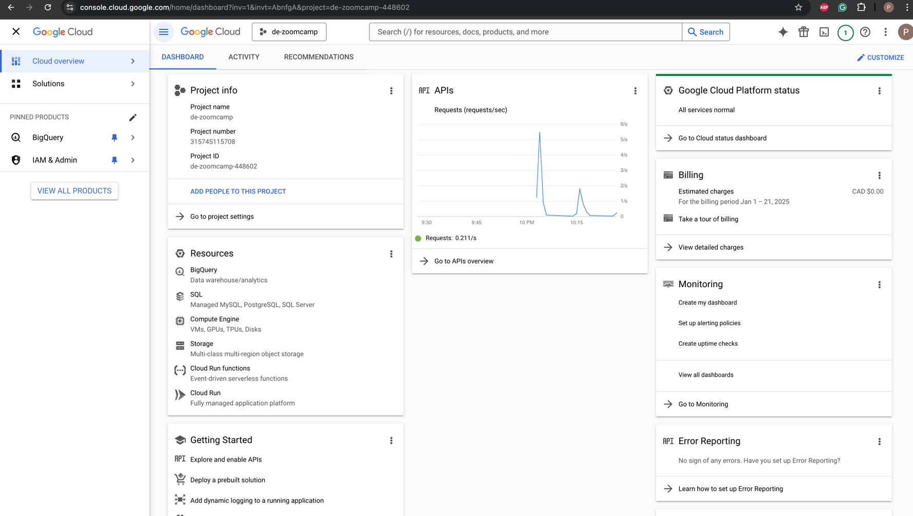
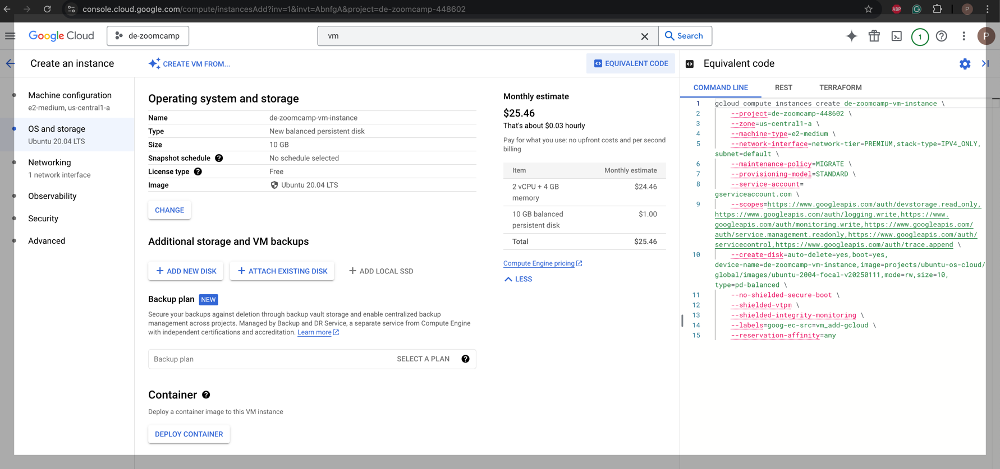
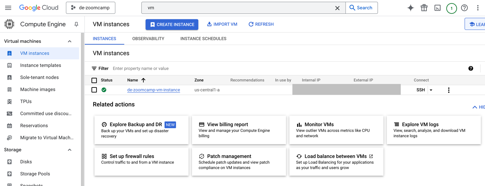
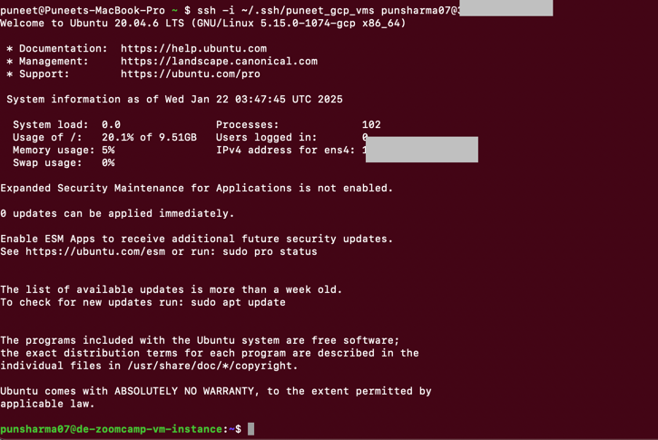

1. Create Google Cloud platform account and new project `de-zoomcamp`

2. Generate new ssh key on local terminal and copy public key in GCP's metadata by following Google's 
documentation https://cloud.google.com/compute/docs/connect/add-ssh-keys
3. Create a new VM instance by providing required details

4. Test ssh connection to gcp vm instances from local machine
