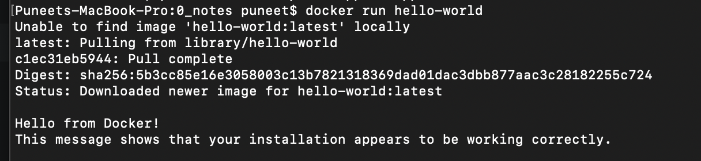
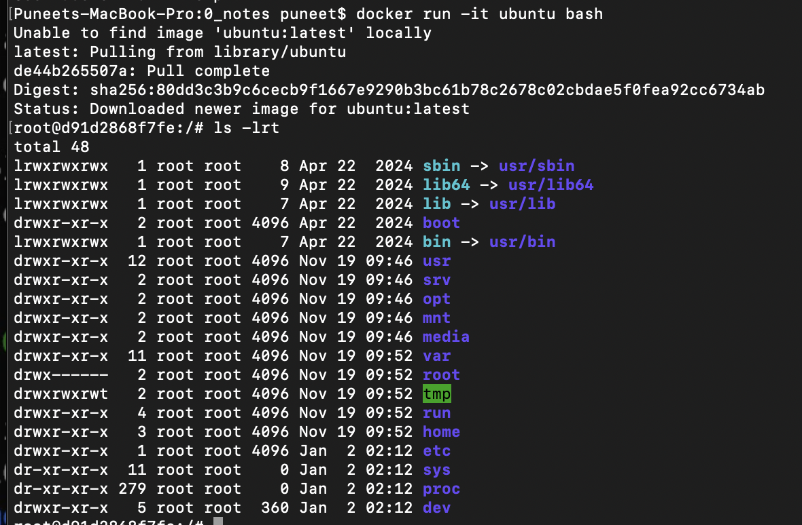
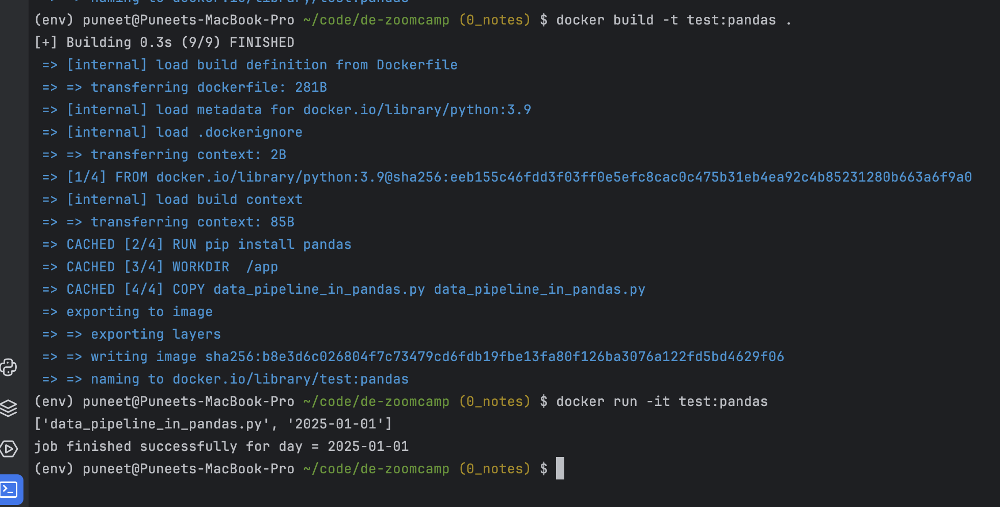
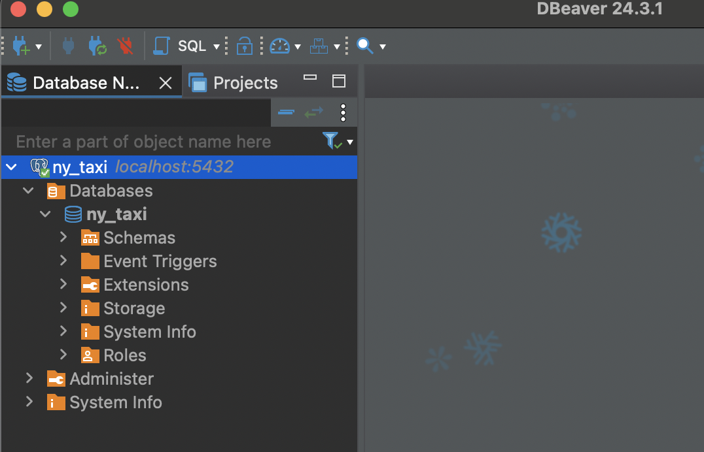
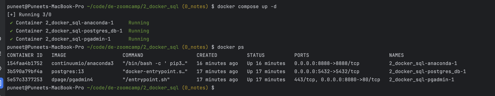
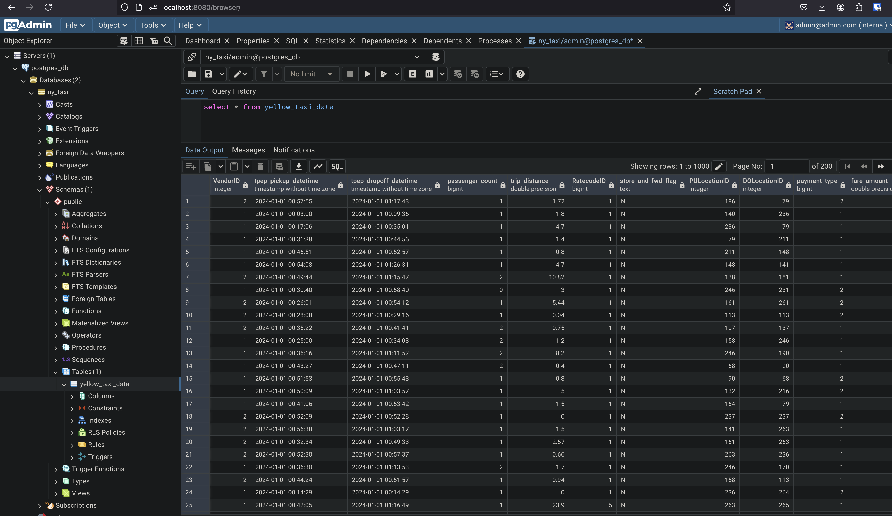

### Description  
This page contains main architecture diagram of data-engineering tools, techniques and pipelines and initial commands for 
installation packages

### Table of contents
1. [Install docker](#Install_docker)
2. [Create docker file](#create_docker_file)
3. [Build docker image](#build_docker_image)
4. [Run the docker image](#run_docker_image)
5. [Create postgres container through command line](#pg_container)
6. [Test postgres connection (using dbeaver)](#test_pg)
7. [Download New York Yellow taxi Dataset parquet file](#dataset)
8. [Create docker compose file](#compose)
9. [Spin-up docker to create containers](#spinup)


### Action Items
1. Install docker <a name="Install_docker"></a>   
https://docs.docker.com/desktop/setup/install/mac-install/  
Test docker installation using following command 
    ```terminal
    docker run hello-world
    ```
      
    


2. Create docker file  <a name="create_docker_file"></a>  
Create Dockerfile in root dir with python 3.9 as base image and install pandas. Set entry 
point to run python script  

    ```dockerfile
   FROM python:3.9
   RUN pip install pandas
   WORKDIR  /app
   COPY data_pipeline_in_pandas.py data_pipeline_in_pandas.py
   ENTRYPOINT [ "python", "data_pipeline_in_pandas.py" ]
   # Default parameters
   CMD ["2025-01-01"]
   ```

3. Build docker image <a name="build_docker_image"></a>
    ```terminal
    docker build -t test:pandas .
    ```
   
4. Run the docker image <a name="run_docker_image"></a>
    ```terminal
    docker run -it test:pandas
    ```
   


5. Create postgres container through command line <a name="pg_container"></a> 
   ```terminal
   docker run -it  \
   -e POSTGRES_USER="admin" \
   -e POSTGRES_PASSWORD="password" \
   -e POSTGRES_DB="ny_taxi" \
   -p 5432:5432 \
   -v $(pwd)/2_docker_sql/postgres_sql_data:/var/lib/postgresql/data postgres:13 
   ```
   
6. Test postgres connection (using dbeaver)  <a name="test_pg"></a>
 


7. Download New York Yellow taxi Dataset parquet file:   <a name="dataset"></a>
Download from [link](https://www.nyc.gov/site/tlc/about/tlc-trip-record-data.page)
and load to postgres table as shown in file [upload_data_parquet.ipynb](https://github.com/punsharma07/de-zoomcamp/blob/a3e4aaa46118da914f9f960711d8ecfdb3a38dc7/2_docker_sql/upload_data_parquet.ipynb) 
or better readable python file [ingest_nytaxi_data.py](https://github.com/punsharma07/de-zoomcamp/blob/a3e4aaa46118da914f9f960711d8ecfdb3a38dc7/2_docker_sql/ingest_nytaxi_data.py)


8. Create docker compose file:  <a name="compose"></a>
Define poatgres, pgadmin and anaconda services:
This is to minimize manual installation on GCP VMs later
    ```yaml 
    services:
      # postgres container to store data
      postgres_db:
        image: postgres:13
        environment:
          - POSTGRES_USER=admin
          - POSTGRES_PASSWORD=password
          - POSTGRES_DB=ny_taxi
        volumes:
          - ./postgres_sql_data:/var/lib/postgresql/data:rw
        ports:
          - "5432:5432"
    
      # pgadmin container to interact with data using SQL queries
      pgadmin:
        image: dpage/pgadmin4
        environment:
          - PGADMIN_DEFAULT_EMAIL=admin@admin.com
          - PGADMIN_DEFAULT_PASSWORD=root
        ports:
          - "8080:80"
    
      # anaconda container to run data ingestion script
      anaconda:
        image: continuumio/anaconda3
        volumes:
          - ./:/opt/notebooks
        ports:
          - "8888:8888"
        # install required python packages, jupyter, # create notebook server without creds/token
        command:
          /bin/bash -c "
          pip3 install --root-user-action=ignore -r /opt/notebooks/requirements.txt 
          && /opt/conda/bin/conda install jupyter -y --quiet
          && /opt/conda/bin/jupyter notebook --notebook-dir=/opt/notebooks --ip='0.0.0.0'
          --port=8888 --no-browser --allow-root --NotebookApp.token='' --NotebookApp.password='' 
          "
        tty: true 
        # “keep the container running” 
    ```
   
9. Spin-up docker to create containers: <a name="spinup"></a>
    ```bash 
   docker compose up -d
   docker ps
   ```
    
After spinning up docker, we should be able to access pgadmin at [http://localhost:8080/browser/](http://localhost:8080/browser/) 
and jupyter-notebook at [http://localhost:8888/tree](http://localhost:8888/tree)

