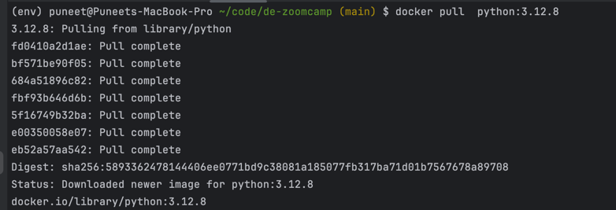
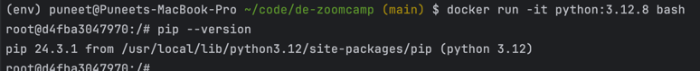
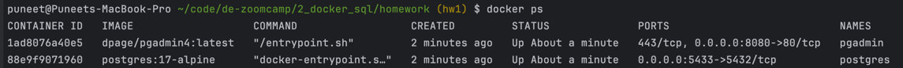
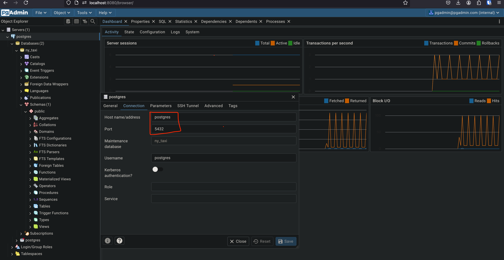

## Question 1. Understanding docker first run

What's the version of `pip` in the image?

- 24.3.1
- 24.2.1
- 23.3.1
- 23.2.1

Answer: 24.3.1 




## Question 2. Understanding Docker networking and docker-compose

Given the following `docker-compose.yaml`, what is the `hostname` and `port` that **pgadmin** should use to connect to the postgres database?

```yaml
services:
  db:
    container_name: postgres
    image: postgres:17-alpine
    environment:
      POSTGRES_USER: 'postgres'
      POSTGRES_PASSWORD: 'postgres'
      POSTGRES_DB: 'ny_taxi'
    ports:
      - '5433:5432'
    volumes:
      - vol-pgdata:/var/lib/postgresql/data

  pgadmin:
    container_name: pgadmin
    image: dpage/pgadmin4:latest
    environment:
      PGADMIN_DEFAULT_EMAIL: "pgadmin@pgadmin.com"
      PGADMIN_DEFAULT_PASSWORD: "pgadmin"
    ports:
      - "8080:80"
    volumes:
      - vol-pgadmin_data:/var/lib/pgadmin  

volumes:
  vol-pgdata:
    name: vol-pgdata
  vol-pgadmin_data:
    name: vol-pgadmin_data
```

- postgres:5433
- localhost:5432
- db:5433
- postgres:5432
- db:5432

### Answer: postgres:5432 





##  Prepare Postgres

Run Postgres and load data as shown in the videos
We'll use the green taxi trips from October 2019:

```bash
wget https://github.com/DataTalksClub/nyc-tlc-data/releases/download/green/green_tripdata_2019-10.csv.gz
```

You will also need the dataset with zones:

```bash
wget https://github.com/DataTalksClub/nyc-tlc-data/releases/download/misc/taxi_zone_lookup.csv
```

Download this data and put it into Postgres.

You can use the code from the course. It's up to you whether
you want to use Jupyter or a python script.  
Link of python script: 


## Question 3. Trip Segmentation Count

During the period of October 1st 2019 (inclusive) and November 1st 2019 (exclusive), how many trips, **respectively**, happened:
1. Up to 1 mile
2. In between 1 (exclusive) and 3 miles (inclusive),
3. In between 3 (exclusive) and 7 miles (inclusive),
4. In between 7 (exclusive) and 10 miles (inclusive),
5. Over 10 miles 

Answers:

- 104,802;  197,670;  110,612;  27,831;  35,281
- 104,802;  198,924;  109,603;  27,678;  35,189
- 104,793;  201,407;  110,612;  27,831;  35,281
- 104,793;  202,661;  109,603;  27,678;  35,189
- 104,838;  199,013;  109,645;  27,688;  35,202

**Correct answer is: 104,802;  198,924;  109,603;  27,678;  35,189**

```sql
select 'Up to 1 mile' as distance,
count(*) 
from green_tripdata gt
where lpep_pickup_datetime >= '2019-10-01 00:00:00'  
	and lpep_pickup_datetime < '2019-11-01 00:00:00'
	and lpep_dropoff_datetime < '2019-11-01 00:00:00' 
	and trip_distance  <= 1 -- 104,802
union all
select 'In between 1 (exclusive) and 3 miles (inclusive),' as distance,
count(*) 
from green_tripdata gt
where lpep_pickup_datetime >= '2019-10-01 00:00:00'  
	and lpep_pickup_datetime < '2019-11-01 00:00:00'
	and lpep_dropoff_datetime < '2019-11-01 00:00:00' 
and trip_distance  > 1 and trip_distance  <=3 -- 198,924
union all
select 'In between 3 (exclusive) and 7 miles (inclusive)' as distance,
count(*) 
from green_tripdata gt
where lpep_pickup_datetime >= '2019-10-01 00:00:00'  
	and lpep_pickup_datetime < '2019-11-01 00:00:00'
	and lpep_dropoff_datetime < '2019-11-01 00:00:00' 
and trip_distance  > 3 and trip_distance  <=7 -- 109,603
union all
select 'In between 7 (exclusive) and 10 miles (inclusive)' as distance,
count(*) 
from green_tripdata gt
where lpep_pickup_datetime >= '2019-10-01 00:00:00'  
	and lpep_pickup_datetime < '2019-11-01 00:00:00'	
	and lpep_dropoff_datetime < '2019-11-01 00:00:00' 
and  trip_distance  > 7 and trip_distance  <=10 -- 27,678
union all
select 'Over 10 miles' as distance,
count(*) 
from green_tripdata gt
where lpep_pickup_datetime >= '2019-10-01 00:00:00'  
	and lpep_pickup_datetime < '2019-11-01 00:00:00'
	and lpep_dropoff_datetime < '2019-11-01 00:00:00' 
and  trip_distance  > 10 -- 35,189
```

## Question 4. Longest trip for each day

Which was the pick up day with the longest trip distance?
Use the pick up time for your calculations.

Tip: For every day, we only care about one single trip with the longest distance. 

- 2019-10-11
- 2019-10-24
- 2019-10-26
- 2019-10-31

**Solution is : 2019-10-31**

```sql
select lpep_pickup_datetime :: date, 
max(trip_distance) as max_trip_distance_of_the_day
from green_tripdata gt 
group by 1
order by max_trip_distance_of_the_day desc
limit 1
/*
lpep_pickup_datetime|max_trip_distance_of_the_day|
--------------------+----------------------------+
          2019-10-31|                      515.89|
*/   
```

## Question 5. Three biggest pickup zones

Which were the top pickup locations with over 13,000 in
`total_amount` (across all trips) for 2019-10-18?

Consider only `lpep_pickup_datetime` when filtering by date.
 
- East Harlem North, East Harlem South, Morningside Heights
- East Harlem North, Morningside Heights
- Morningside Heights, Astoria Park, East Harlem South
- Bedford, East Harlem North, Astoria Park

**Solution is: East Harlem North, East Harlem South, Morningside Heights**

```sql
select "PULocationID", tzl."Zone",  sum(gt.total_amount) as total_amount_by_zones 
from green_tripdata gt 
join taxi_zone_lookup tzl on gt."PULocationID"  = tzl."LocationID" 
where lpep_pickup_datetime :: date = '2019-10-18'
group by 1,2
having sum(gt.total_amount) > 13000
/*
  PULocationID|Zone               |total_amount_by_zones|
------------+-------------------+---------------------+
          74|East Harlem North  |   18686.679999999742|
          75|East Harlem South  |   16797.259999999787|
         166|Morningside Heights|   13029.789999999903|
*/ 
```

## Question 6. Largest tip

For the passengers picked up in October 2019 in the zone
name "East Harlem North" which was the drop off zone that had
the largest tip?

Note: it's `tip` , not `trip`

We need the name of the zone, not the ID.

- Yorkville West
- JFK Airport
- East Harlem North
- East Harlem South

**Solution is: JFK Airport**

```sql
select tzl_do."Zone"
from
(
select "PULocationID", "DOLocationID", max(tip_amount) max_tip_amount
from green_tripdata gt 
join taxi_zone_lookup tzl on gt."PULocationID"  = tzl."LocationID" 
where to_char(lpep_pickup_datetime, 'YYYYMM') :: int = 201910
and tzl."Zone" = 'East Harlem North'
group by 1,2 order by max_tip_amount desc limit 1
) trip_with_max_tip
join taxi_zone_lookup tzl_do on trip_with_max_tip."DOLocationID" = tzl_do."LocationID"
-- JFK Airport
```