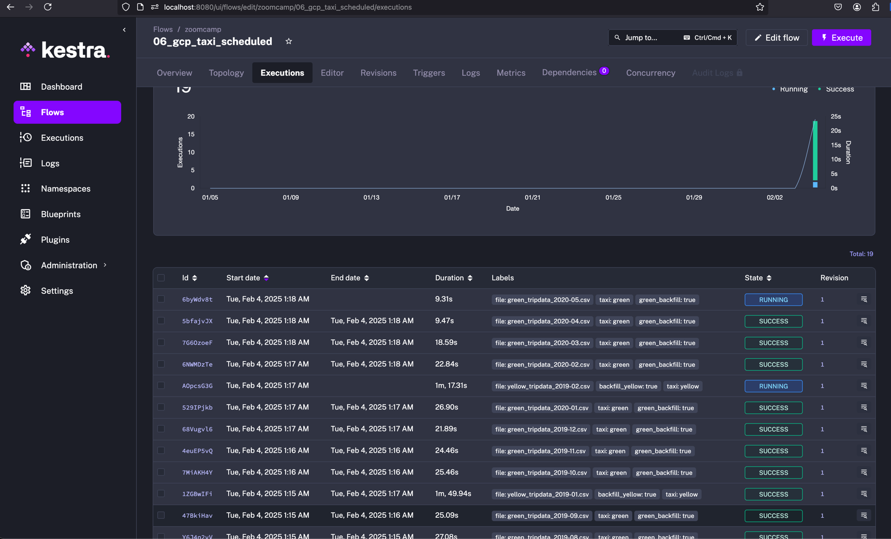
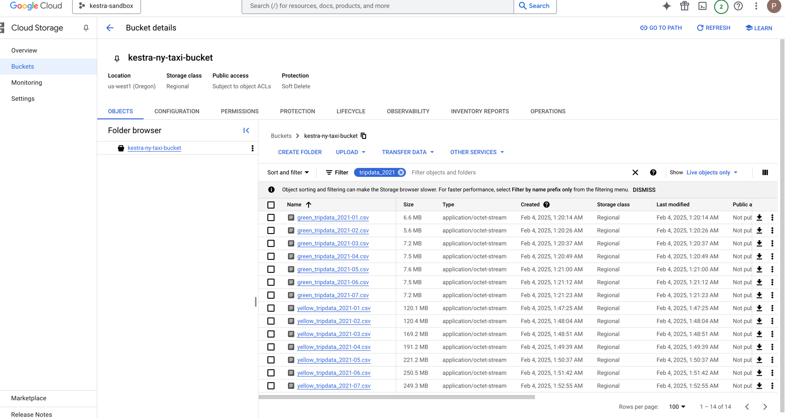
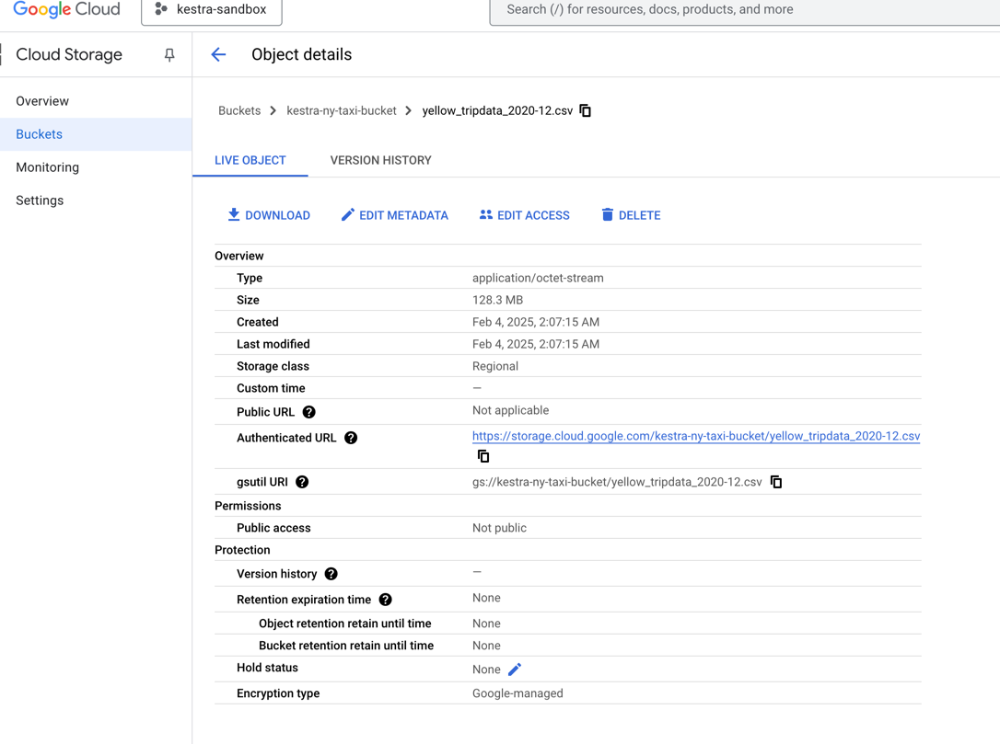
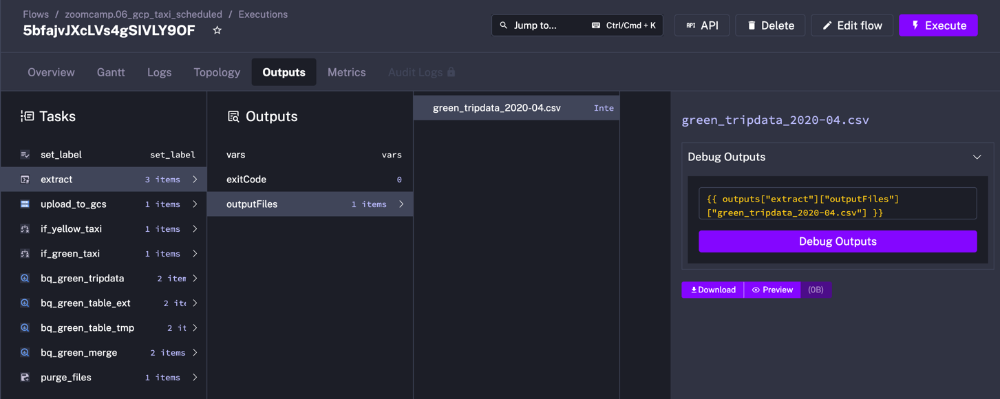
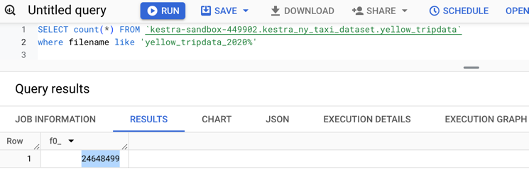
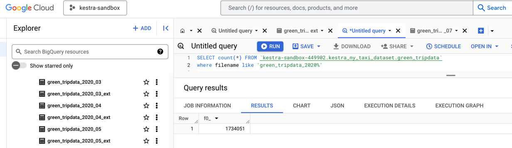
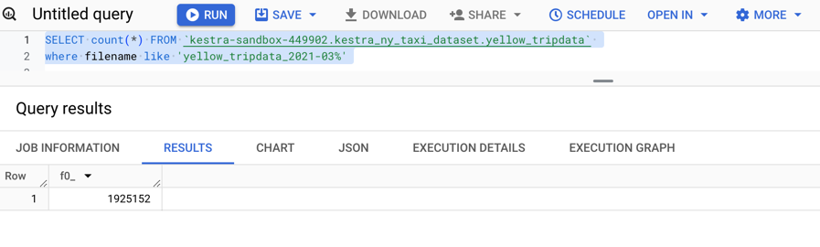
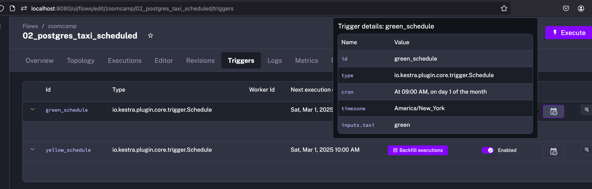

Backfill ingestion (while running in parallel for green and yellow taxi


Extended 2021 files list



Quiz:

1) Within the execution for `Yellow` Taxi data for the year `2020` and month `12`: what is the uncompressed file size (i.e. the output file `yellow_tripdata_2020-12.csv` of the `extract` task)?
- **128.3 MB** <-- :white_check_mark: This is the right answer
- 134.5 MB
- 364.7 MB
- 692.6 MB 



2) What is the rendered value of the variable `file` when the inputs `taxi` is set to `green`, `year` is set to `2020`, and `month` is set to `04` during execution?
- `{{inputs.taxi}}_tripdata_{{inputs.year}}-{{inputs.month}}.csv` 
- `green_tripdata_2020-04.csv`  <-- :white_check_mark: This is the right answer
- `green_tripdata_04_2020.csv`
- `green_tripdata_2020.csv` 




3) How many rows are there for the `Yellow` Taxi data for all CSV files in the year 2020?
- 13,537.299
- **24,648,499** <-- :white_check_mark: This is the right answer
- 18,324,219
- 29,430,127



4) How many rows are there for the `Green` Taxi data for all CSV files in the year 2020?
- 5,327,301
- 936,199
- **1,734,051** <-- :white_check_mark: This is the right answer 
- 1,342,034 
- 


5) How many rows are there for the `Yellow` Taxi data for the March 2021 CSV file?
- 1,428,092
- 706,911
- **1,925,152** <-- :white_check_mark: This is the right answer 
- 2,561,031



6) How would you configure the timezone to New York in a Schedule trigger?
- Add a `timezone` property set to `EST` in the `Schedule` trigger configuration  
- **Add a `timezone` property set to `America/New_York` in the `Schedule` trigger configuration** :white_check_mark: This is the right answer
- Add a `timezone` property set to `UTC-5` in the `Schedule` trigger configuration
- Add a `location` property set to `New_York` in the `Schedule` trigger configuration  

```yml
    triggers:
      - id: green_schedule
        type: io.kestra.plugin.core.trigger.Schedule
        cron: "0 9 1 * *"
        timezone: America/New_York
        inputs:
          taxi: green
    
      - id: yellow_schedule
        type: io.kestra.plugin.core.trigger.Schedule
        cron: "0 10 1 * *"
        timezone: America/New_York
        inputs:
          taxi: yellow
      
```
