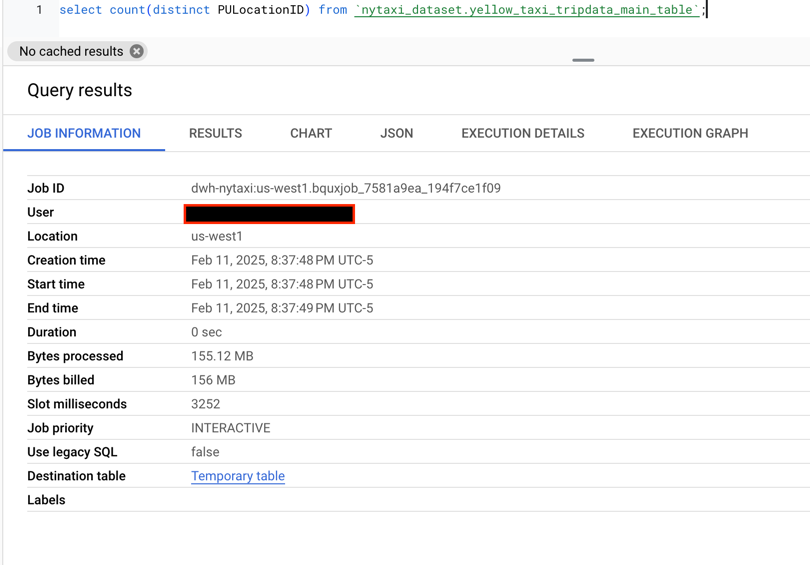

## Module 3 Homework

1. Using GCS upload script, uploaded 6 parquet files to GCS bucket


2. Create external table from all available yellow_tripdata parquet GCS files using following query
    ```sql
    CREATE OR REPLACE EXTERNAL TABLE `nytaxi_dataset.yellow_taxi_tripdata_ext_table`
    OPTIONS (
      format = 'PARQUET',
      uris = ['gs://dwh-nytaxi-bucket/yellow_tripdata_2024-*.parquet']
    );
    ```
    
3. Create regular table using following query
    ```sql
    CREATE OR REPLACE TABLE `nytaxi_dataset.yellow_taxi_tripdata_main_table`
    AS SELECT * FROM `nytaxi_dataset.yellow_taxi_tripdata_ext_table`;
    ```
    

## Question 1:
Question 1: What is count of records for the 2024 Yellow Taxi Data?
- 65,623
- 840,402
- **20,332,093**  <-- :white_check_mark: This is the right answer
- 85,431,289  


## Question 2:
Write a query to count the distinct number of PULocationIDs for the entire dataset on both the tables.</br> 
What is the **estimated amount** of data that will be read when this query is executed on the External Table and the Table?

- 18.82 MB for the External Table and 47.60 MB for the Materialized Table
- **0 MB for the External Table and 155.12 MB for the Materialized Table** <-- :white_check_mark: This is the right answer
- 2.14 GB for the External Table and 0MB for the Materialized Table
- 0 MB for the External Table and 0MB for the Materialized Table  





## Question 3:
Write a query to retrieve the PULocationID from the table (not the external table) in BigQuery. Now write a query to retrieve the PULocationID and DOLocationID on the same table. Why are the estimated number of Bytes different?
- **BigQuery is a columnar database, and it only scans the specific columns requested in the query. Querying two columns (PULocationID, DOLocationID) requires 
reading more data than querying one column (PULocationID), leading to a higher estimated number of bytes processed.** <-- :white_check_mark: This is the right answer
- BigQuery duplicates data across multiple storage partitions, so selecting two columns instead of one requires scanning the table twice, 
doubling the estimated bytes processed.
- BigQuery automatically caches the first queried column, so adding a second column increases processing time but does not affect the estimated bytes scanned.
- When selecting multiple columns, BigQuery performs an implicit join operation between them, increasing the estimated bytes processed

## Question 4:
How many records have a fare_amount of 0?
- 128,210
- 546,578
- 20,188,016
- **8,333** <-- :white_check_mark: This is the right answer    


## Question 5:
What is the best strategy to make an optimized table in Big Query if your query will always filter based on tpep_dropoff_datetime and order the results by VendorID (Create a new table with this strategy)
- **Partition by tpep_dropoff_datetime and Cluster on VendorID** <-- :white_check_mark: This is the right answer
- Cluster on by tpep_dropoff_datetime and Cluster on VendorID
- Cluster on tpep_dropoff_datetime Partition by VendorID
- Partition by tpep_dropoff_datetime and Partition by VendorID  


## Question 6:
Write a query to retrieve the distinct VendorIDs between tpep_dropoff_datetime
2024-03-01 and 2024-03-15 (inclusive)</br>

Use the materialized table you created earlier in your from clause and note the estimated bytes. Now change the table in the from clause to the partitioned table you created for question 5 and note the estimated bytes processed. What are these values? </br>

Choose the answer which most closely matches.</br> 

- 12.47 MB for non-partitioned table and 326.42 MB for the partitioned table
- **310.24 MB for non-partitioned table and 26.84 MB for the partitioned table** <-- :white_check_mark: This is the right answer
- 5.87 MB for non-partitioned table and 0 MB for the partitioned table
- 310.31 MB for non-partitioned table and 285.64 MB for the partitioned table  


## Question 7: 
Where is the data stored in the External Table you created?

- Big Query
- Container Registry
- **GCP Bucket** <-- :white_check_mark: This is the right answer
- Big Table

## Question 8:
It is best practice in Big Query to always cluster your data:
- True
- **False** <-- :white_check_mark: This is the right answer